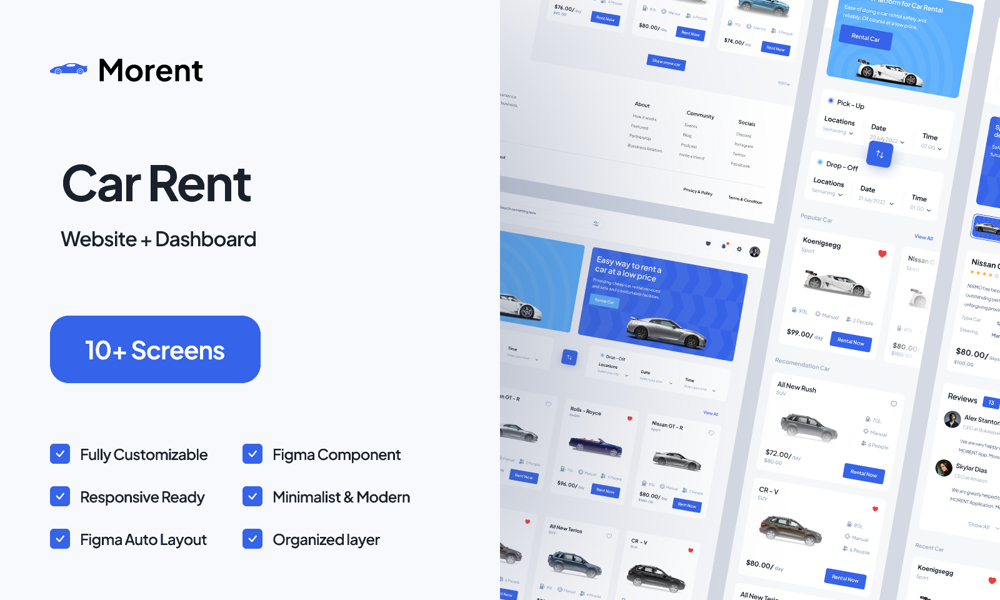

# Morent(Rent-a-car) - (Vue.js/Nuxt)

This project is a Figma design implementation for the a rent-a-car web app called Morent, created by PickoLab Studio. It was built using Vue/Nuxt and styled with Tailwind CSS.

You can view the original Figma design here: [Figma](https://www.figma.com/design/k3bKaFHRguOtsAjz3Nfkfr/Car-Rent-Website-Design---Pickolab-Studio-(Community)).